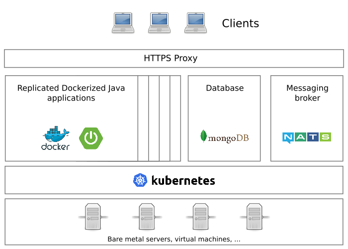

# Spring on Kubernetes !

## Purpose

This is a small demonstration application built with Spring Boot and VueJS, intended to be deployed on a Kubernetes cluster.
With this application, you can upload documents, sign them then check them with a PGP key. 

A living demo on a Kubernetes cluster is available here: [spring-demo.remi-pace.fr](https://spring-demo.remi-pace.fr) - 
sorry for the self-signed certificate, I have done too many experiments with Let's Encrypt :)

**Disclaimer**: This is a night project, I've done it after work in few days, so a lot of things can
be improved !

## Architecture diagram



## Why microservices ?

Microservices is a great opportunity for companies:

- Software lifecyle is boosted, deploy features in few hours !
- All technologies can be used and can work together, including technologies that are normally incompatible with each other
- Application components are small, easy to change and maintain
- Applications are scalable, they can grow as need come

## Why Kubernetes ?

Kubernetes offer many advantages:

- With Kubernetes and Docker, deploying an application is really easy
- Applications are monitored and responsive: they heal themselves, and they can scale automatically according to their activities
- The use of servers is optimized: no RAM or CPU that sleep and cost money
- Infrastructure can scale on demand: add or remove servers when needed without service interruptions

## Which technologies are used here

For application backend:

- Spring Boot as main framework
- RxJava for reactive structure and performances
- NATS messaging for synchronous communication between microservices
- Helm Chart for Kubernetes deployments
- Ansible for server configuration

For frontend:

- VueJS as component oriented framework
- Typescript as language
- Webpack as application build tool

Development tools:

- Docker Compose for development environment (should maybe replaced by Minikube)
- JUnit 4, Mockito and Jacoco for testing and coverage reports (should be replaced with JUnit 5)
- Gradle as application build tool
- Python 3 for scripting

## Use and test application

⚠️ Warning: This application has only been tested on Ubuntu and Alpine Linux

You can try this application locally easily. Install prerequisites:

```
    $ sudo apt install -y docker-ce nodejs npm python3 python-pip gnupg2
    $ sudo pip install --upgrade pip
    $ sudo pip install docker-compose
```

Then clone and launch the projetc:

```
    $ git clone https://github.com/remipassmoilesel/spring-k8s-demo
    $ cd spring-k8s-demo

    $ ./dev.py demo
```

## Deploy on a Kubernetes cluster

You will need a running Kubernetes cluster and an ingress controller. You can make trials quickly and easily with 
[Minikube](https://kubernetes.io/docs/tutorials/stateless-application/hello-minikube/).

Then adapt the deployment file with the address of your MongoDB database: [kubernetes/values.yaml](kubernetes/values.yaml)

And finally deploy:

```
    $ ./dev.py deploy
```

## What else ?

A first version, more "monolithic", is available at tag 0.1 with a MariaDB/MySQL database.

## IntelliJ settings for development

In order to restart application on build in developement mode, configure Intellij:

     File | Settings | Build, Execution, Deployment | Build Tools | Gradle | Runner
     => Delegate IDE build/run actions to gradle.

## TODO

- Application auto-scaling setup
- Sonarqube analysis and CI/CD example
- Kubernetes statefulset for databases

