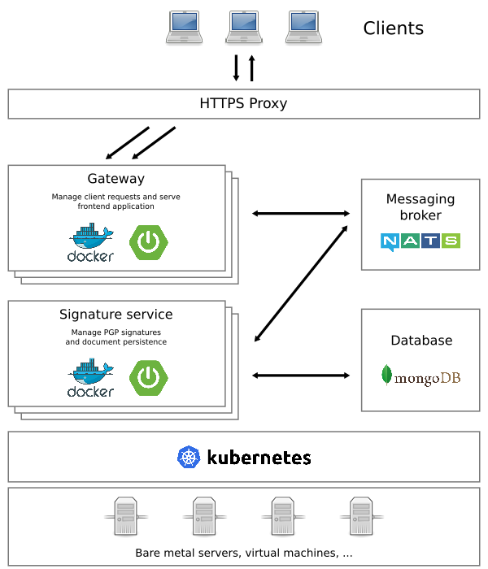

# Spring on Kubernetes !

## Purpose

This is a small demonstration application built with Spring Boot and VueJS, intended to be deployed on a Kubernetes cluster.
With this application, you can upload documents, sign them then check them with a PGP key.

A living demo on a Kubernetes cluster is available here: [spring-demo.remi-pace.fr](https://spring-demo.remi-pace.fr) -
sorry for the self-signed certificate, I have done too many experiments with Let's Encrypt :)

**Disclaimer**: This is a night project, I've done it after work in few days, so a lot of things can
be improved !

## Architecture diagram



## Why microservices ?

Microservices is a great opportunity for companies:

- Software lifecyle is boosted, deploy features in few hours !
- All technologies can be used and can work together, including technologies that are normally incompatible with each other
- Application components are small, easy to change and maintain
- Applications are scalable, they can grow as need come

## Why Kubernetes ?

Kubernetes offer many advantages:

- With Kubernetes and Docker, deploying an application is really easy
- Applications are monitored and responsive: they heal themselves, and they can scale automatically according to their activities
- The use of servers is optimized: no RAM or CPU that sleep and cost money
- Infrastructure can scale on demand: add or remove servers when needed without service interruptions

## Which technologies are used here

For application backend:

- [Spring Boot](https://projects.spring.io/spring-boot/) as main framework
- [RxJava](https://github.com/ReactiveX/RxJava) for reactive structure and performances
- [NATS](https://nats.io) messaging for synchronous communication between microservices
- [Helm Chart](https://helm.sh) for Kubernetes deployments
- [Ansible](https://www.ansible.com) for server configuration

For frontend:

- [VueJS](https://vuejs.org) as component oriented framework
- [Typescript](https://www.typescriptlang.org) as language
- [Webpack](https://webpack.js.org) as application build tool

Development tools:

- [Docker Compose](https://docs.docker.com/compose/) for development environment (should maybe replaced by Minikube)
- [JUnit 4](https://junit.org/junit4/), [Mockito](http://site.mockito.org) and [Jacoco](https://www.eclemma.org/jacoco/) for testing and coverage reports (should be replaced with JUnit 5)
- [Gradle](https://gradle.org) as application build tool
- [Python 3](https://www.python.org/about/) for scripting

## Use and test application

⚠️ Warning: This application has only been tested on Ubuntu and Alpine Linux

You can try this application locally easily. Install prerequisites:

```
    $ sudo apt install -y docker-ce nodejs npm python3 python-pip gnupg2
    $ sudo pip install --upgrade pip
    $ sudo pip install docker-compose
```

Then clone and launch the project:

```
    $ git clone https://github.com/remipassmoilesel/spring-k8s-demo
    $ cd spring-k8s-demo

    $ ./cli.py --help
    $ ./cli.py --start
```

## Deploy on a Kubernetes cluster

You will need a running Kubernetes cluster and an ingress controller. You can make trials quickly and easily with
[Minikube](https://kubernetes.io/docs/tutorials/stateless-application/hello-minikube/).

Then adapt the deployment file with the address of your MongoDB database: [kubernetes/values.yaml](infrastructure/helm-chart/values.yaml)

And finally deploy:

```
    $ ./dev.py deploy
```

## What else ?

A first version, more "monolithic", is available at tag 0.1 with a MariaDB/MySQL database.

You can browse it on Github here: [v0.1](https://github.com/remipassmoilesel/spring-k8s-demo/tree/v0.1)

## IntelliJ settings for development

In order to restart application on build in developement mode, configure Intellij:

     File | Settings | Build, Execution, Deployment | Build Tools | Gradle | Runner
     => Delegate IDE build/run actions to gradle.

## What can I improve ?

As said on top, this is a night project, I've done it after work in few days, so a lot of things can be improved.

- Make a chart per application, in order to deploy them separately,
- Add a CI/CD example, with a Sonarqube analysis
- Use Kubernetes statefulset for databases
- Setup application auto-scaling
- More unit tests, and more integration tests
- A better development environment, maybe with Minikube

